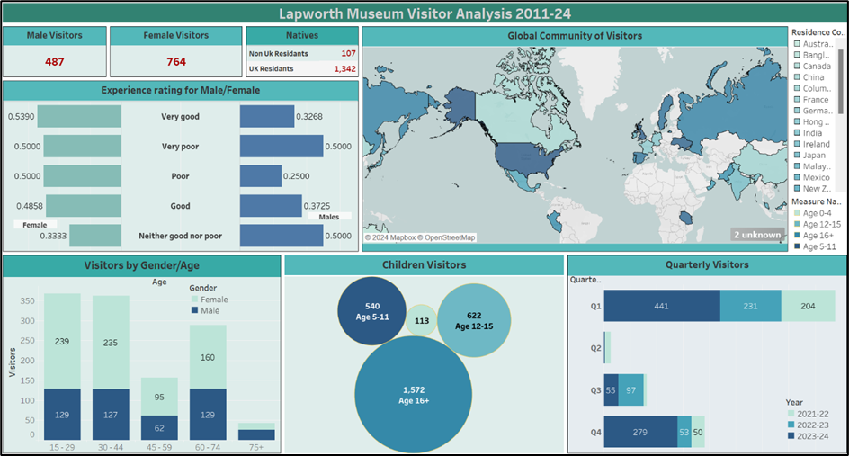

 <h1 align="center"><b>Lapworth-Museum-Sentiment-Analysis</b></h1>

 ## Client Background :
The Lapworth Museum of Geology is one of the oldest specialist geological museums in the United Kingdom, located at the University of Birmingham. Established in 1880, the museum houses over 250,000 specimens, including fossils, minerals, and geological archives, serving as an important educational and research resource.
The museum attracts a diverse audience, including students, families, researchers, and international visitors, and plays a key role in promoting geological education and public engagement.

## Business Problem : 
Despite its strong reputation and high visitor satisfaction, the museum lacked a structured, data-driven approach to analyzing visitor feedback.

The key challenges were:

•	Understanding overall visitor sentiment across multiple platforms

•	Identifying recurring issues affecting visitor experience

•	Comparing performance with similar institutions

•	Translating feedback into actionable improvements

The objective of this project was to transform unstructured feedback data into meaningful insights to support strategic decision-making.

## Executive Summary :
This project analyzes visitor feedback from multiple sources, including internal museum surveys, Google Reviews, and TripAdvisor.

Key findings:

•	The museum maintains a strong positive reputation, with approximately 75% positive sentiment internally and 85% positive sentiment externally 

•	Visitors consistently highlight the museum as educational, engaging, and family-friendly 

•	Key areas for improvement include navigation, signage, and parking accessibility 

The project provides actionable recommendations and proposes a sustainable feedback loop using Net Promoter Score (NPS) to support continuous improvement.

## Data Structure :

This project integrates multiple datasets to provide a comprehensive analysis:

Data Sources:

-	Internal Feedback Dataset 

    ~1,800 survey responses from museum visitors 

-	Google Reviews 

    Public user reviews reflecting real visitor experiences 

-	TripAdvisor Reviews 

    External platform data for benchmarking sentiment 

- Benchmark Data 

    Manchester Museum
  
    Barber Institute of Fine Arts 
    
-	Visitor Demographics & Global Data 

    Age, gender, and geographic distribution

## Methodology :

A structured data analytics approach was applied:

1. Data Preprocessing
   
   •	Removal of stopwords and irrelevant terms

   •	Lowercasing and text normalization

   •	Lemmatization for consistency

2. Sentiment Analysis

   •	Tool: TextBlob (Python)
   
   •	Output:
   
     Polarity score (-1 to +1)
   
     Sentiment classification (Positive / Neutral / Negative)

3. Thematic Analysis

   •	Word cloud generation

   •	Identification of recurring themes in feedback

4. Benchmarking Analysis

   •	Comparison with similar museums 

   •	Evaluation of relative sentiment performance 

5. Data Visualization

   •	Tool: Tableau
   
   •	Interactive dashboards for:

      Sentiment distribution 

      Visitor demographics
   
      Geographic insights
 
      Time-based trends 

## Results :

This section presents the key findings derived from sentiment analysis, thematic exploration, and benchmarking of visitor feedback across multiple data sources, including internal museum surveys and external platforms such as Google Reviews and TripAdvisor.  

The analysis aims to uncover overall visitor sentiment, identify recurring themes, and highlight areas of strength and improvement to support data-driven decision-making.

### 1. SENTIMENT OVERVIEW

•	Strong positive sentiment across all sources, with ~75% internally and ~85% externally, indicating high visitor satisfaction. 

•	Low negative feedback, suggesting only minor issues impact overall experience. 

•	External reviews are slightly more positive, reinforcing a strong public perception. 

•	Neutral feedback highlights opportunities to further enhance visitor experience.

##
<b>1. Lapworth Sentiment (Internal Data)</b>

 

<b>Internal feedback shows ~75% positive sentiment, indicating strong visitor satisfaction.</b>

##
<b>2. Google + TripAdvisor Sentiment (External Data)</b>

 

<b>External platforms show even higher positivity (~85%), reinforcing the museum’s strong reputation.</b>

##
### 2. THEMATIC INSIGHTS

##
<b>Positive Themes</b>

<table>
  <tr>
    <td align="center">
      
       <b>Lapworth Positive Feedback World Cloud</b>
    </td>
    <td align="center">
      
       <b>Google & TripAdvisor Positive Feedback World Cloud</b>
    </td>
  </tr>
</table>

##
•	Visitors frequently describe the museum as educational, engaging, and informative.

•	The experience is perceived as fun and family-friendly, appealing to a wide audience.

•	Free entry is a key factor contributing to positive sentiment.

##
<b>Negative Themes</b>

<table>
  <tr>
    <td align="center">
      
       <b>Lapworth Positive Feedback World Cloud</b>
    </td>
    <td align="center">
      
       <b>Google & TripAdvisor Positive Feedback World Cloud</b>
    </td>
  </tr>
</table>

##
•	Navigation and signage issues make the museum difficult to find.

•	Parking challenges are a recurring concern.

•	Some visitors perceive the museum as small or limited in content.

•	Occasional feedback suggests lack of engagement in certain exhibits.

#
### 3. BENCHMARKING
#

  

#

<table>
  <tr>
    <td align="center">
      
       <b>Word cloud showing negative sentiment for Manchester Museum </b>
    </td>
    <td align="center">
      
       <b>Word cloud showing positive sentiment for Barber Institute</b>
    </td>
  </tr>
</table>

##

•	Strong comparative performance, with Lapworth matching Manchester Museum and slightly outperforming the Barber Institute in sentiment scores.

•	Exhibit quality outweighs scale, as larger museums face criticism for less engaging or incomplete displays.

•	Specialization is a key strength, with focused museums like Lapworth and Barber driving stronger visitor engagement.

•	Opportunity to improve interaction, particularly through better staff engagement and more interactive experiences.
#

### DASHBOARD 
#

🔗 [Analytics Dashboard](https://public.tableau.com/views/LapworthMuseumDashboard/Dashboard1?:language=en-US&:sid=&:redirect=auth&:display_count=n&:origin=viz_share_link)

 

# 

<b>Dashboard Insights :</b>
#
•	Higher engagement from female visitors, with 764 compared to 487 male visitors, indicating stronger resonance of exhibits with female audiences. 

•	Visitor base is predominantly local, with over 1,300 UK visitors compared to a small number of international visitors, highlighting potential for expanding 
global outreach. 

•	Peak attendance occurs in Q1 and Q4, while Q2 and Q3 show significantly lower visitor numbers, indicating seasonal imbalance in engagement. 

•	Strong appeal among younger and middle-aged groups (15–44), while engagement drops notably for ages 45–59 and 75+, suggesting opportunities for targeted programming. 

•	Female visitors report more positive experiences, whereas male visitors tend to give more neutral ratings, indicating differences in satisfaction across genders. 

